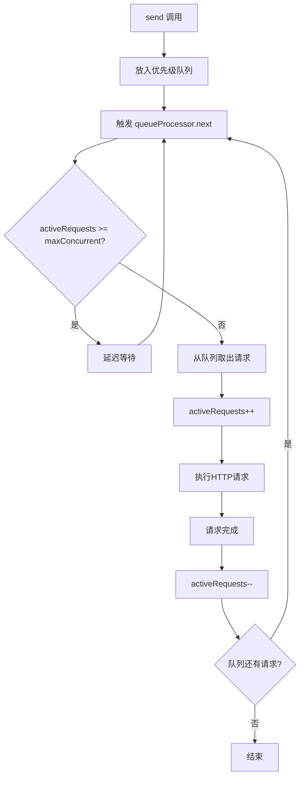

# RequestChannel 使用文档

## 概述

`RequestChannel` 是一个基于 RxJS 的高级请求管理工具，提供并发控制、优先级队列、请求去重、轮询管理等功能。适用于需要精细化控制 HTTP 请求的场景。

## 特性

- ✅ **并发控制**：限制同时进行的请求数量
- ✅ **优先级队列**：支持高、中、低优先级请求
- ✅ **请求去重**：自动检测和缓存重复请求
- ✅ **轮询管理**：智能轮询任务状态，支持去重和取消
- ✅ **依赖注入**：可自定义验证器、服务等组件
- ✅ **状态监控**：实时监控队列和活跃请求状态
- ✅ **错误处理**：完善的错误处理和重试机制

## 快速开始

### 基本初始化

```typescript
import { RequestChannel } from './utils/requestChannel';

// 最简单的初始化
const requestChannel = new RequestChannel();

// 带配置的初始化
const requestChannel = new RequestChannel({
  maxConcurrent: 3, // 最大并发数
  apiBaseUrl: '/api/v1', // API基础URL
  retryDelay: 2000, // 重试延迟（毫秒）
  requestTimeout: 30000, // 请求超时（毫秒）
});
```

### 发送基本请求

```typescript
// 发送普通请求
requestChannel
  .send({
    jobType: 'DATA_PROCESSING',
    data: { userId: 123, action: 'process' },
  })
  .subscribe({
    next: (response) => console.log('请求成功:', response),
    error: (error) => console.error('请求失败:', error),
  });

// 发送高优先级请求
requestChannel
  .send({
    jobType: 'URGENT_TASK',
    priority: 'high',
    data: { taskId: 456 },
  })
  .subscribe({
    next: (response) => console.log('高优先级请求完成:', response),
  });
```

## 核心功能

### 1. 优先级管理

```typescript
// 低优先级请求（默认用于轮询等后台任务）
requestChannel.send({
  jobType: 'BACKGROUND_SYNC',
  priority: 'low',
  data: { syncType: 'incremental' },
});

// 普通优先级请求（默认）
requestChannel.send({
  jobType: 'USER_ACTION',
  priority: 'normal', // 可省略
  data: { action: 'save' },
});

// 高优先级请求（用户直接操作）
requestChannel.send({
  jobType: 'CRITICAL_UPDATE',
  priority: 'high',
  data: { urgent: true },
});
```

### 2. 轮询任务管理

```typescript
// 开始轮询任务状态
const pollingSubscription = requestChannel
  .pollTaskStatus('task-123', {
    intervalMs: 2000, // 轮询间隔
    maxAttempts: 50, // 最大尝试次数
    maxDurationMs: 300000, // 最大持续时间
  })
  .subscribe({
    next: (result) => {
      console.log('任务状态更新:', result);
      if (result.status === 'SUCCESS') {
        console.log('任务完成!', result.data);
      }
    },
    error: (error) => console.error('轮询失败:', error),
  });

// 取消特定任务轮询
requestChannel.cancelPolling('task-123');

// 取消所有轮询
requestChannel.cancelAllPolling();
```

### 3. 状态监控

```typescript
// 监控活跃请求数
requestChannel.getActiveRequestsObservable().subscribe((count) => {
  console.log(`当前活跃请求数: ${count}`);
});

// 获取队列状态
const queueStatus = requestChannel.getQueueStatus();
console.log('队列状态:', {
  总排队数: queueStatus.totalQueued,
  高优先级: queueStatus.highPriority,
  普通优先级: queueStatus.normalPriority,
  低优先级: queueStatus.lowPriority,
  活跃请求: queueStatus.activeRequests,
});

// 获取轮询任务列表
const pollingTasks = requestChannel.getPollingTasks();
console.log('轮询任务:', pollingTasks);
```

## 高级配置

### 依赖注入

```typescript
import { RequestChannel, RequestValidator, JobService, JobStatusChecker, EndpointMapper } from './utils/requestChannel';

// 自定义验证器
class CustomValidator implements RequestValidator {
  validate(request: any): void {
    if (!request.userId) {
      throw new Error('用户ID不能为空');
    }
    // 更多自定义验证逻辑
  }
}

// 自定义作业服务
class CustomJobService implements JobService {
  async sendJob(request: any): Promise<any> {
    // 自定义请求发送逻辑
    return fetch('/custom-api', {
      method: 'POST',
      body: JSON.stringify(request),
    });
  }

  async queryJob(params: { jobId: string }): Promise<any> {
    // 自定义查询逻辑
    return fetch(`/custom-api/status/${params.jobId}`);
  }

  updateJob(response: any): void {
    // 自定义更新逻辑
    console.log('Job updated with custom logic:', response);
  }
}

// 自定义状态检查器
class CustomStatusChecker implements JobStatusChecker {
  isSuccess(status: string): boolean {
    return ['COMPLETED', 'DONE', 'FINISHED'].includes(status);
  }

  isFailed(status: string): boolean {
    return ['ERROR', 'FAILED', 'CANCELLED'].includes(status);
  }

  isRunning(status: string): boolean {
    return ['PROCESSING', 'IN_PROGRESS'].includes(status);
  }

  isQueued(status: string): boolean {
    return ['PENDING', 'WAITING'].includes(status);
  }
}

// 自定义端点映射器
const endpointMapper = new DefaultEndpointMapper({
  DATA_PROCESSING: '/process-data',
  FILE_UPLOAD: '/upload',
  QUERY_STATUS: '/job-status',
});

// 使用自定义依赖创建RequestChannel
const requestChannel = new RequestChannel(
  {
    maxConcurrent: 5,
    apiBaseUrl: '/api/v2',
    retryDelay: 1500,
    requestTimeout: 60000,
  },
  {
    validator: new CustomValidator(),
    jobService: new CustomJobService(),
    statusChecker: new CustomStatusChecker(),
    endpointMapper: endpointMapper,
  },
);
```

### 动态配置更新

```typescript
// 更新端点映射
requestChannel.updateEndpointMap({
  NEW_JOB_TYPE: '/new-endpoint',
  UPDATED_JOB: '/updated-endpoint',
});
```

## 实际应用示例

### 文件上传 with 进度轮询

```typescript
class FileUploadService {
  constructor(private requestChannel: RequestChannel) {}

  async uploadFile(file: File): Promise<any> {
    try {
      // 1. 发送文件上传请求
      const uploadResponse = await this.requestChannel
        .send({
          jobType: 'FILE_UPLOAD',
          priority: 'high',
          data: {
            fileName: file.name,
            fileSize: file.size,
            fileData: file, // 实际场景可能需要转换为base64等
          },
        })
        .toPromise();

      const jobId = uploadResponse.data.jobId;

      // 2. 轮询上传进度
      return this.requestChannel
        .pollTaskStatus(jobId, {
          intervalMs: 1000,
          maxAttempts: 300,
          maxDurationMs: 600000, // 10分钟超时
        })
        .toPromise();
    } catch (error) {
      console.error('文件上传失败:', error);
      throw error;
    }
  }
}

// 使用示例
const fileService = new FileUploadService(requestChannel);
const fileInput = document.querySelector('#fileInput') as HTMLInputElement;

fileInput.addEventListener('change', async (event) => {
  const file = (event.target as HTMLInputElement).files?.[0];
  if (file) {
    try {
      const result = await fileService.uploadFile(file);
      console.log('文件上传完成:', result);
    } catch (error) {
      console.error('上传失败:', error);
    }
  }
});
```

### 批量数据处理

```typescript
class BatchProcessor {
  constructor(private requestChannel: RequestChannel) {}

  async processBatch(items: any[]): Promise<any[]> {
    const results: Promise<any>[] = [];

    // 将批量任务分解为多个请求，利用优先级控制
    items.forEach((item, index) => {
      const priority = index < 5 ? 'high' : 'normal'; // 前5个高优先级

      const request = this.requestChannel
        .send({
          jobType: 'BATCH_ITEM_PROCESS',
          priority,
          data: { item, batchId: Date.now(), index },
        })
        .toPromise();

      results.push(request);
    });

    // 等待所有请求完成
    return Promise.all(results);
  }
}
```

## API 参考

### RequestChannel 构造函数

```typescript
constructor(
  config?: RequestChannelConfig,
  dependencies?: {
    validator?: RequestValidator;
    jobService?: JobService;
    statusChecker?: JobStatusChecker;
    endpointMapper?: EndpointMapper;
  }
)
```

### 主要方法

| 方法                  | 参数                                  | 返回值                                 | 描述         |
| --------------------- | ------------------------------------- | -------------------------------------- | ------------ |
| `send<T>()`           | `PriorityRequest`                     | `Observable<T>`                        | 发送请求     |
| `pollTaskStatus<T>()` | `taskId: string, config?: PollConfig` | `Observable<T>`                        | 轮询任务状态 |
| `cancelPolling()`     | `taskId: string`                      | `{success: boolean, message?: string}` | 取消轮询     |
| `cancelAllPolling()`  | -                                     | `{cancelledCount: number}`             | 取消所有轮询 |
| `getQueueStatus()`    | -                                     | `QueueStatus`                          | 获取队列状态 |
| `clearQueue()`        | -                                     | `{clearedCount: number}`               | 清空队列     |
| `destroy()`           | -                                     | `void`                                 | 销毁实例     |

### 接口定义

```typescript
interface PriorityRequest {
  jobType: string;
  priority?: 'low' | 'normal' | 'high';
  [key: string]: any;
}

interface RequestChannelConfig {
  maxConcurrent?: number; // 默认: 5
  apiBaseUrl?: string; // 默认: '/api'
  retryDelay?: number; // 默认: 1000ms
  requestTimeout?: number; // 默认: 300000ms (5分钟)
}

interface PollConfig {
  intervalMs?: number; // 默认: 3000ms
  maxAttempts?: number; // 默认: 100
  maxDurationMs?: number; // 默认: 无限制
}
```

## 最佳实践

### 1. 合理设置优先级

```typescript
// ✅ 正确的优先级使用
requestChannel.send({
  jobType: 'USER_CLICK_ACTION',
  priority: 'high', // 用户直接操作
  data: { action: 'save' },
});

requestChannel.send({
  jobType: 'AUTO_SAVE',
  priority: 'normal', // 自动保存
  data: { draft: true },
});

requestChannel.send({
  jobType: 'ANALYTICS_TRACK',
  priority: 'low', // 埋点上报
  data: { event: 'page_view' },
});
```

### 2. 错误处理

```typescript
requestChannel
  .send({
    jobType: 'IMPORTANT_TASK',
    data: { taskData: 'something' },
  })
  .pipe(
    retry(3), // 自动重试3次
    catchError((error) => {
      console.error('请求最终失败:', error);
      // 降级处理或用户提示
      return of({ error: true, message: '请求失败，请稍后重试' });
    }),
  )
  .subscribe((result) => {
    if (result.error) {
      // 处理错误情况
    } else {
      // 处理成功情况
    }
  });
```

### 3. 资源清理

```typescript
class MyComponent {
  private subscriptions: Subscription[] = [];

  constructor(private requestChannel: RequestChannel) {}

  someMethod() {
    const sub = this.requestChannel
      .send({
        jobType: 'SOME_TASK',
        data: {},
      })
      .subscribe((response) => {
        // 处理响应
      });

    this.subscriptions.push(sub);
  }

  ngOnDestroy() {
    // 清理订阅
    this.subscriptions.forEach((sub) => sub.unsubscribe());

    // 如果这是最后一个使用RequestChannel的组件
    this.requestChannel.destroy();
  }
}
```

### 4. 监控和调试

```typescript
// 开发环境下的监控
if (process.env.NODE_ENV === 'development') {
  requestChannel.getActiveRequestsObservable().subscribe((count) => {
    console.log(`[RequestChannel] 活跃请求数: ${count}`);
  });

  // 定期输出队列状态
  setInterval(() => {
    const status = requestChannel.getQueueStatus();
    if (status.totalQueued > 0) {
      console.log('[RequestChannel] 队列状态:', status);
    }
  }, 5000);
}
```

### 5. 轮询机制



## 注意事项

1. **内存管理**：及时取消不需要的轮询任务和订阅
2. **并发设置**：根据服务器性能合理设置 `maxConcurrent`
3. **超时配置**：根据业务场景设置合适的超时时间
4. **错误处理**：始终为请求添加错误处理逻辑
5. **优先级使用**：避免滥用高优先级，保持系统响应性

## 故障排除

### 常见问题

**Q: 请求一直在队列中不执行？**
A: 检查是否达到并发限制，或者前面的请求是否卡住

**Q: 轮询任务无法取消？**
A: 确保使用正确的 taskId，检查是否已经完成

**Q: 请求重复执行？**
A: 检查请求指纹生成逻辑，确保去重机制正常工作

### 调试方法

```typescript
// 启用详细日志
console.log('队列状态:', requestChannel.getQueueStatus());
console.log('轮询任务:', requestChannel.getPollingTasks());
console.log('活跃请求数:', requestChannel.getActiveRequestCount());
```
